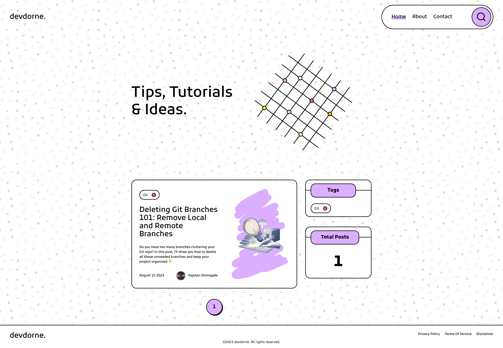

# devdorne

Welcome to devdorne. Our mission is to provide quality articles ranging from beginner to advanced levels to help you become a better programmer.



## Tech Stack

```js
- Nuxt: 3.7.0
- Nuxt Content: 2.7.2
- Typescript: 5.1.6
- TailwindCSS: 3.3.3
- Pinia: 2.1.6
```


## Run Locally

Clone the project

```bash
  git clone git@github.com:kajtd/devdorne.git
```

Go to the project directory

```bash
  cd devdorne
```

Install dependencies

```bash
  npm install
```

Start the server

```bash
  npm run dev
```


## License

[MIT](./LICENSE.txt)

